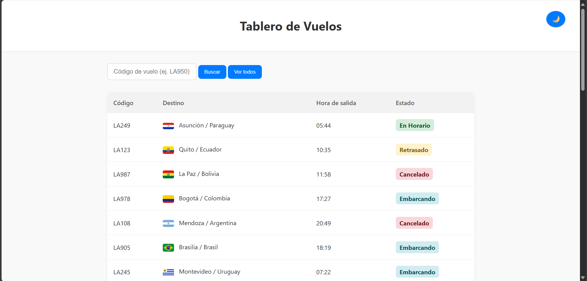
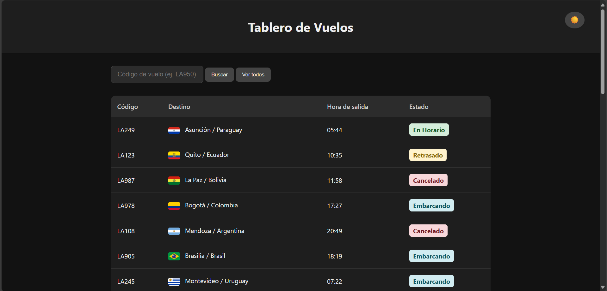
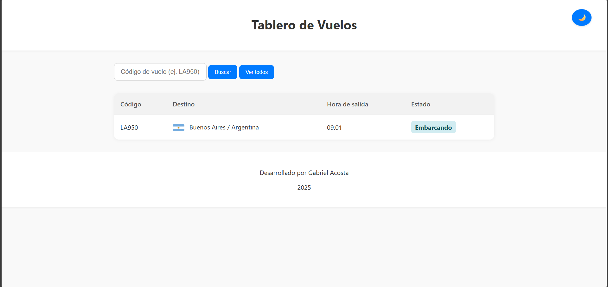
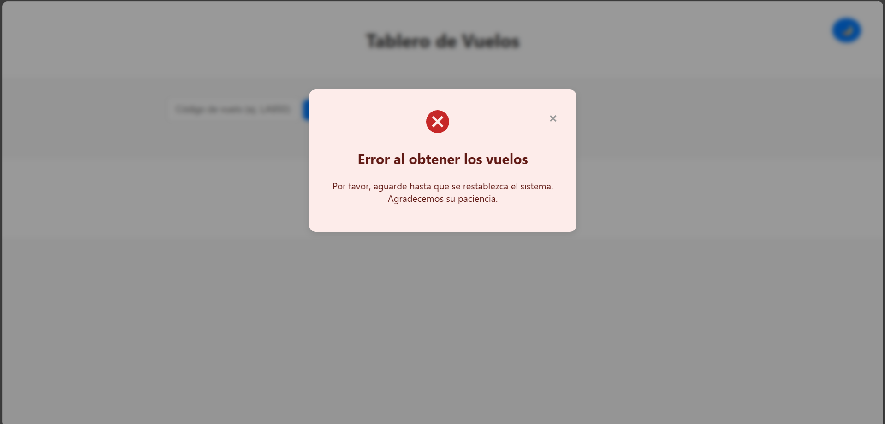

# Tablero de Vuelos

Este proyecto es una interfaz web moderna para visualizar información de vuelos. Fue desarrollado con HTML, CSS y JavaScript, incorporando efectos visuales elegantes, modo oscuro, y manejo de errores mediante modales.

---

## Funcionalidades principales

- **Visualización de vuelos**: muestra una tabla con datos como código, destino, horario y estado.
- **Buscador de vuelos**: permite filtrar por código de vuelo.
- **Modo oscuro / modo claro**: alternable mediante un botón con íconos animados.
- **Estados visuales**: cada estado de vuelo se muestra con color distintivo (verde, amarillo, rojo, azul).
- **Modal de error**: si el vuelo no existe o hay problemas al cargar los datos, se muestra un modal visual con ícono y mensaje.
---

## Tecnologías utilizadas

- **HTML5** para la estructura.
- **CSS3** con efectos modernos, modo oscuro, sin diseño responsivo.
- **JavaScript** para lógica de búsqueda, alternación de modo y manejo de errores.
---

## Estructura del proyecto
    Parcial1_Gabriel_Acosta
    ├── index.html
    ├── style.css
    ├── script.js
    └── vuelos.json
---

## Cómo usar?

1. Cloná el repositorio.
2. Asegurate de tener el archivo `vuelos.json` con la información de vuelos.
3. Abrí `index.html` en tu navegador.
4. Probá el buscador, alterná el modo visual y observá el comportamiento ante errores.
---

## Notas

- El desarrollo de la interfaz se inspiró en el estilo Apple.
- El botón de modo oscuro está ubicado arriba a la derecha y alterna entre modo oscuro y modo claro con animación.
- El modal de error se reutiliza tanto para errores de búsqueda como de carga.
- El fondo del modal de error es rojo suave, con ícono SVG de advertencia.
- El sistema está preparado para fallos de red o archivo, mostrando mensajes claros al usuario.
---

## Vista previa

> *Primer vista de la página.*
>
> * Vista de la página en modo oscuro.*
> 
> * Búsqueda por código de vuelo exitosa.*
> 
> * Error al encontrar el vuelo.*
> 
> * Error al cargar los vuelos.*
---

## Autor

**Gabriel Acosta**  

Desarrollador Backend y estudiante avanzado en Análisis de Sistemas  
Argentina - 21/09/2025

---